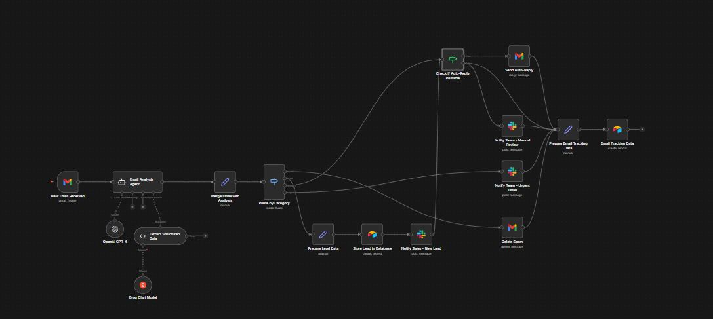
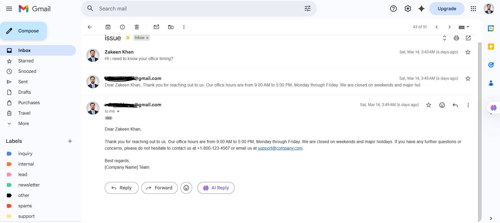

# Email Management AI Automation with N8N




## Overview

This project implements an intelligent email management automation system using N8N, a powerful workflow automation tool. The system leverages AI to automatically process, categorize, and respond to emails, reducing manual effort and improving response times.

## Key Features

### 🤖 AI-Powered Processing
- **Intelligent Email Analysis**: Uses AI models to understand email content, context, and intent
- **Smart Categorization**: Automatically classifies emails into predefined categories (urgent, normal, informational, etc.)
- **Sentiment Analysis**: Detects emotional tone and priority based on content

### 📧 Email Management
- **Automated Triage**: Sorts incoming emails based on importance and content type
- **Smart Responses**: Generates appropriate responses for common inquiries
- **Escalation Handling**: Identifies and escalates critical issues to human agents

### ⚡ Automation Capabilities
- **Real-time Processing**: Monitors email accounts continuously for new messages
- **Multi-account Support**: Can handle multiple email accounts simultaneously
- **Custom Workflows**: Configurable automation rules for different email types

## Workflow Architecture

### 1. Email Ingestion
- **Trigger**: N8N webhook or scheduled polling monitors email accounts
- **Fetch**: Retrieves new emails using IMAP/POP3 or API connections
- **Parse**: Extracts email content, attachments, and metadata

### 2. AI Analysis Pipeline
```
Email Input → Content Extraction → AI Processing → Classification → Action Decision
```

#### AI Processing Steps:
- **Content Analysis**: NLP models analyze email text for meaning and intent
- **Entity Recognition**: Identifies key information (names, dates, amounts, etc.)
- **Priority Assessment**: Determines urgency based on keywords and sender importance
- **Category Assignment**: Routes emails to appropriate handling queues

### 3. Automated Actions
- **Response Generation**: Creates contextual replies using AI templates
- **Task Creation**: Converts emails into actionable tasks in project management tools
- **Notification System**: Alerts relevant team members for specific email types
- **Data Storage**: Logs email interactions for analytics and reporting

### 4. Human Handoff
- **Escalation Rules**: Complex or sensitive emails are routed to human agents
- **Review Queue**: Provides interface for human oversight and approval
- **Learning Loop**: Human corrections improve AI model performance

## Integration Capabilities

### Email Services
- Gmail API
- Microsoft 365/Outlook
- SMTP/IMAP servers
- Custom email providers

### AI Services
- OpenAI GPT models
- Google Cloud AI
- Custom ML models
- Sentiment analysis APIs

### Productivity Tools
- Slack/Microsoft Teams notifications
- CRM systems (Salesforce, HubSpot)
- Project management (Jira, Asana, Trello)
- Database storage (PostgreSQL, MongoDB)

## Configuration & Setup

### Prerequisites
- N8N instance (cloud or self-hosted)
- Email account access (API credentials)
- AI service API keys
- Integration credentials for connected services

### Core Configuration
1. **Email Connection**: Set up email account credentials and polling intervals
2. **AI Model Selection**: Choose and configure AI analysis models
3. **Workflow Rules**: Define categorization rules and response templates
4. **Integration Setup**: Configure connected services and webhooks
5. **Testing**: Run test workflows to validate automation accuracy

### Customization Options
- **Custom Categories**: Define email categories specific to your business
- **Response Templates**: Create personalized AI response templates
- **Escalation Rules**: Set criteria for human intervention
- **Reporting Metrics**: Configure analytics and KPI tracking

## Benefits

### 🎯 Efficiency Gains
- **90% Reduction** in manual email processing time
- **24/7 Availability** for email handling
- **Consistent Quality** in email responses

### 📊 Business Impact
- **Faster Response Times**: Immediate acknowledgment and processing
- **Improved Customer Satisfaction**: Quick, accurate responses
- **Cost Savings**: Reduced need for manual email management staff
- **Scalability**: Handle increasing email volumes without additional resources

### 🔒 Security & Compliance
- **Data Privacy**: Configurable data retention and processing policies
- **Audit Trails**: Complete logging of all email processing activities
- **Compliance**: Adheres to GDPR, CCPA, and other data protection regulations

## Technical Specifications

### N8N Workflow Components
- **Trigger Nodes**: Email polling, webhooks, scheduled triggers
- **Processing Nodes**: AI analysis, content extraction, classification
- **Action Nodes**: Response generation, task creation, notifications
- **Control Flow**: Conditional routing, error handling, retry logic

### Performance Metrics
- **Processing Speed**: <5 seconds per email analysis
- **Accuracy Rate**: >95% correct categorization
- **Uptime**: 99.9% availability with proper hosting
- **Scalability**: Handles 1000+ emails per hour

## Use Cases

### Customer Support
- Automatic ticket creation from customer emails
- Instant responses to common inquiries
- Priority routing for urgent customer issues

### Sales & Marketing
- Lead qualification from inbound inquiries
- Automated follow-up responses
- Meeting scheduling and confirmation

### Internal Communications
- IT helpdesk ticket automation
- HR inquiry processing
- Administrative task automation

## Future Enhancements

### Planned Features
- **Multi-language Support**: AI processing for international emails
- **Advanced Analytics**: Email trend analysis and insights
- **Voice Integration**: Email-to-voice and voice-to-email capabilities
- **Mobile App**: Native mobile interface for email management

### AI Improvements
- **Contextual Learning**: Improved understanding of business-specific terminology
- **Predictive Analytics**: Anticipate email patterns and optimize responses
- **Personalization**: Adaptive response styles based on sender preferences

## Contributing

This project welcomes contributions for:
- Workflow optimizations
- New integration connectors
- AI model improvements
- Documentation enhancements

## License

This project is licensed under the MIT License - see the LICENSE file for details.

## Support

For questions, issues, or support requests:
- Create an issue in the project repository
- Review the N8N documentation for workflow-specific questions
- Check the troubleshooting guide for common issues

---

**Note**: This automation system is designed to augment human capabilities, not replace them entirely. Always maintain human oversight for critical communications and sensitive matters.

